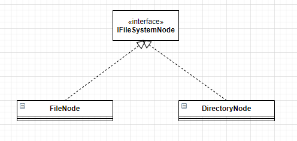
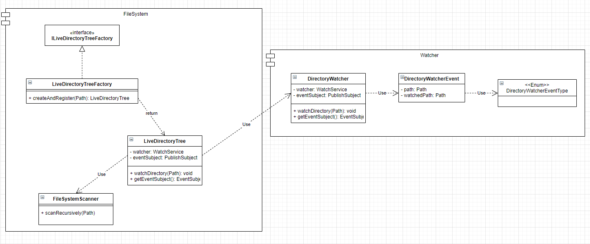
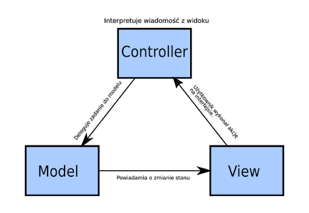
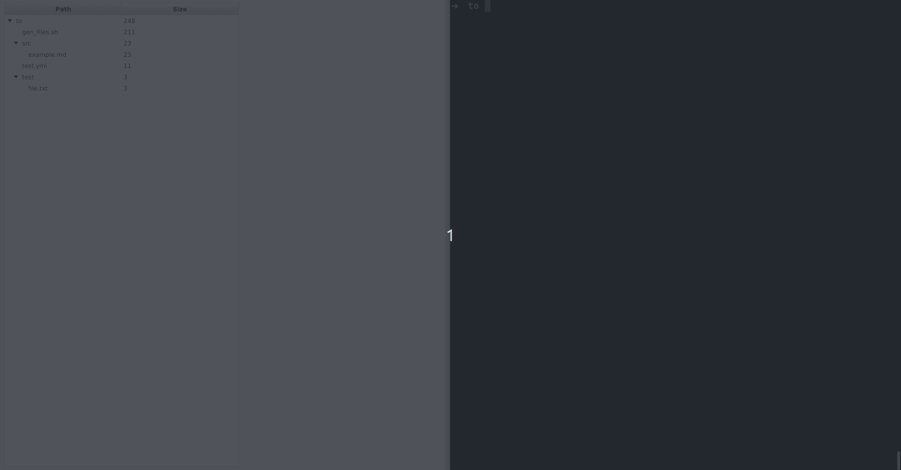

# Dokumentacja projektu

Niniejszy dokument stanowi dokumentację projektu *Disc Stalker* tworzonego w ramach przedmiotu Technologie Obiektowe.
Dokument ten omawia szczegóły tworzonego rozwiązania, natomiast chronologiczna lista zmian
dostępna jest w pliku [CHANGELOG](../CHANGELOG.md).

Autorzy: [Mateusz Surjak](https://github.com/surjak), [Jonatan Kłosko](https://github.com/jonatanklosko), [Nazar Kurdiumov](https://github.com/nazkord), [Mateusz Benecki](https://github.com/beneckimateusz).

- [Dokumentacja projektu](#dokumentacja-projektu)
  - [1. Cel](#1-cel)
  - [2. Model danych](#2-model-danych)
    - [`IFileSystemNode`](#ifilesystemnode)
    - [`DirectoryNode`](#directorynode)
    - [`FileNode`](#filenode)
  - [3. Integracja modelu ze źródłem danych](#3-integracja-modelu-ze-źródłem-danych)
    - [Wczytywanie reprezentacji do pamięci](#wczytywanie-reprezentacji-do-pamięci)
    - [Obserwowanie zmian w systemie plików](#obserwowanie-zmian-w-systemie-plików)
    - [Integracja - synchronizowany model](#integracja---synchronizowany-model)
  - [4. Interfejs użytkownika](#4-interfejs-użytkownika)
    - [Architektura](#architektura)
    - [Prototyp](#prototyp)

## 1. Cel

Celem projektu jest stworzenie aplikacji służącej do monitorowania oraz analizy systemu plików.
Kluczowym aspektem opracowywanego rozwiązania jest efektywne reagowanie na zachodzące zmiany,
tak aby wyświetlane informacje przez cały czas działania programu odzwierciedlały faktyczny stan dysku.

## 2. Model danych

Dane należące do dziedziny aplikacji to pliki przechowywane na dysku,
natomiast swojego rodzaju bazę danych stanowi w tym przypadku system plików.
Powszechnie stosowaną logiczną organizacją systemu plików jest struktura drzewiasta,
w której wyróżnić można katalog, jako specjalny rodzaj pliku grupującego inne pliki.

Model danych dla aplikacji został pomyślany jako odwzorowanie tej koncepcji,
czyli jako hierarchiczna, rekurencyjna struktura drzewiasta.
Zdefiniowano ogólny typ danych reprezentujący dowolny węzeł w drzewie katalogów - `IFileSystemNode` -
oraz jego dwie możliwe realizacje - `DirectoryNode` i `FileNode`, czyli odpowiednio
węzłom pośrednim oraz liściom w drzewie.

### `IFileSystemNode`

Interfejs ujmujący cechy wspólne katalogu i pliku, jako że oba z nich stanowią węzły
w drzewie katalogów. Każdy węzeł posiada cechy takie jak identyfikująca go ścieżka w systemie plików,
rozmiar (t.j. zajmowana przestrzeń dyskowa, pliku bądź całej zawartości katalogu).

### `DirectoryNode`

Reprezentuje węzeł w drzewie katalogów, do której mogą być dołączone kolejne węzły.
W praktyce oznacza to, że obiekt tego typu posiada listę węzłów które zawiera.
Istotny jest tutaj zdefiniowany interfejs `IFileSystemNode`, dzięki czemu
w takiej liście węzłów mogą znajdować sie zarówno zwykłe pliki (`FileNode`),
jak i zagnieżdżone katalogi (`DirectoryNode`).

Według przyjętej koncepcji atrybuty `DirectoryNode` reprezentują
całe poddrzewo, zatem rozmiar czy też liczba plików dotyczą sumarycznych
wartości we wszystkich podrzędnych węzłach.

### `FileNode`

Reprezentuje właściwy plik z danymi, czyli liść w drzewie katalogów
do którego nie można dołączyć kolejnych węzłów.

Atrybuty `FileNode` odpowiadają bezpośrednio obiektowi systemu plików.

## 3. Integracja modelu ze źródłem danych

Zgodnie z założeniem projektowym dane w aplikacji powinny być w efektywny sposób
synchronizowane z rzeczywistym systemem plików. Problem ten można zdekomponować
na dwa niezależne podproblemy:

* utworzenia obiektowej reprezentacji obecnego stanu systemu plików
  (czyli instancji modelu w ustalonym punkcie czasowym)
* obserwacja systemu plików w celu wykrycia zachodzących w nim zmian

W implementacji postanowiono oddelegować te zadania do oddzielnych klas (zgodnie z SRP),
a następnie zintegrować ich funkcjonalność, w celu otrzymania automatycznie synchronizowanej instancji modelu.

### Wczytywanie reprezentacji do pamięci

Zdefiniowano klasę `FileSystemScanner` pozwalającą na utworzenie instancji modelu
odpowiadającej zadanej ścieżce w systemie plików. Proces wczytywania jest rekurencyjny,
ponieważ w przypadku trafienia na katalog wczytywane są wszystkie jego pliki/katalogi potomne.

Ważnym elementem rozwiązania jest możliwość określenia funkcji wykonywanej
dla każdego nowo stworzonego obiektu węzła, dzięki czemu można z zewnątrz
zdefiniować dodatkowe działanie wykonywane w czasie wczytywania modelu.

### Obserwowanie zmian w systemie plików

Zdefiniowano klasę `DirectoryWatcher` obserwującą zmiany we wskazanych katalogach i propagującą informacje o nich.
Klasa wykorzystuje oferowany przez język Java mechanizm obserwacji (`WatchService`), który jest abstrakcją nasłuchiwania
na zmiany systemu plików niezależną od systemu operacyjnego.

Obserwacja zmian odbywa się w osobnym wątku, a w przypadku ich wystąpienia emitowane jest
zdarzenie, które przy pomocy reaktywnego mechanizmu (`PublishSubject`) jest propagowane
do oczekujących go elementów systemu.

### Integracja - synchronizowany model

Zdefiniowano klasę `LiveDirectoryTree` integrującą oba elementy opisane powyżej.
W praktyce oznacza to, że tworzony jest mechanizm nasłuchiwania (`DirectoryWatcher`),
a podczas wczytywania reprezentacji systemu plików (`FileSystemScanner`)
każdy katalog jest dodawany do obserwowanych ścieżek.
W odpowiedzi na zdarzenia modyfikacji systemu plików (pochodzące z `DirectoryWatcher`)
reprezentacja obiektowa jest stosownie modyfikowana, w celu odzwierciedlenia tych zmian.

## 4. Interfejs użytkownika

Aplikacja posiada graficzny interfejs, którego głównym zadaniem jest wyświetlanie
wskazanego drzewa katalogów oraz jego aktualizowanie.
Ponadto ma ona na celu wyświetlenie istotnych statystyk dotyczących obserwowanego katalogu,
w celu identyfikacji interesujących plików.

### Architektura

Głównym zastosowanym wzorcem jest *MVC (Model-View-Controller)*, który wydziela kluczowe komponenty systemu
oraz określający ich odpowiedzialności. Ponadto zastosowano *IoC (Inversion of Control)*,
aby rozluźnić zależności między poszczególnymi elementami.

W systemie stosowane są elementy reaktywne, w szczególności do aktualizacji widoku
na podstawie zmian modelu (będących efektem ciągłej synchronizacji).

### Prototyp

Demo wersji prototypowej wykorzystujące opisane mechanizmy.

